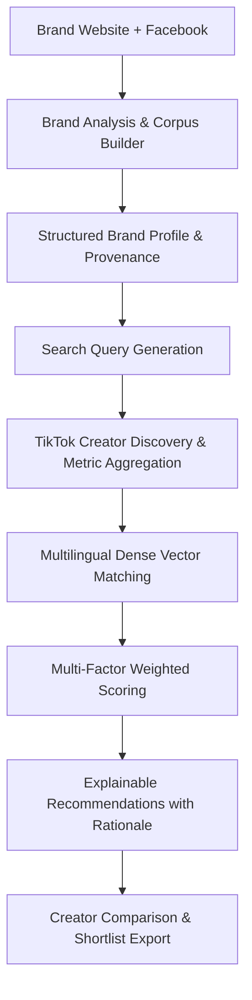
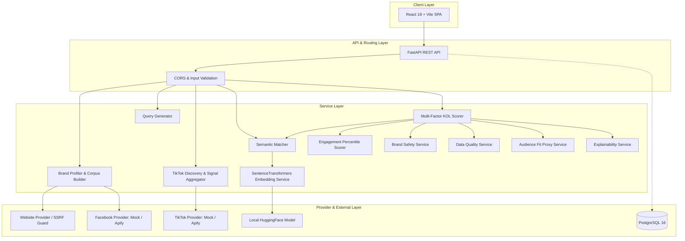

# ThaiKOL AI

## AI-Powered TikTok KOL Matcher for the Thai Market

ThaiKOL AI is an AI-powered creator discovery and recommendation system designed to help brand marketing teams and digital agencies systematically identify, evaluate, and rank relevant TikTok creators in Thailand. The system analyzes public brand signals, discovers creator candidates, performs multilingual semantic matching, and ranks candidates using transparent multi-factor scoring with deterministic explanations.

```
Working Prototype • Multilingual NLP • React 18 • TypeScript • FastAPI • Python 3.12 • PostgreSQL • Docker Compose
```

---

## 1. The Problem

Influencer discovery on TikTok in Thailand is typically a manual, time-intensive process:

* **Brand Context Disconnect**: Marketers must repeatedly define brand identity, product nuances, and positioning across ad-hoc searches.
* **Keyword Fragility**: Relying on generic hashtags (such as `#รีวิว` or `#ใช้ดีบอกต่อ`) fails to identify creators who discuss products using colloquial Thai, regional dialects, or natural conversational styles.
* **Opaque Scoring & Demographic Fabrication**: Many commercial influencer databases calculate proprietary scores without justification or fabricate unverifiable follower demographics (such as age, gender, or income) that cannot be retrieved from public APIs.
* **Screening Inefficiency**: Comparing multiple creators across engagement, content style, brand safety, and local relevance requires manually reviewing dozens of individual profiles.

ThaiKOL AI automates and structures this initial discovery and screening workflow into a transparent, repeatable decision-support system.

---

## 2. The Solution

ThaiKOL AI connects brand intelligence directly to creator discovery and recommendation through an automated pipeline:



1. **Brand Ingestion**: Extracts public text and metadata from a client's website and Facebook page, tracking observed versus inferred evidence.
2. **Autonomous Query Formulation**: Generates targeted Thai and English search terms based on products, themes, and industry keywords.
3. **Candidate Ingestion**: Discovers active creator candidates, deduplicating profiles and aggregating engagement metrics across sample videos.
4. **Semantic Matching**: Measures topical relevance between brand identity and creator content in a shared multilingual vector space.
5. **Multi-Factor Ranking**: Ranks candidates using an audited, configurable formula balancing semantic relevance, engagement quality, local content signals, brand safety, and data completeness.
6. **Transparent Review**: Delivers ranked recommendation cards with granular point contributions, deterministic rationale ("Why this KOL?"), caution notices, and direct links to public TikTok profiles.

---

## 3. How It Works

### 3.1 Brand Analysis

The brand profiling service synthesizes public website HTML and Facebook page context into a structured `BrandProfile`:

* **Industry / Category**: Identified vertical (e.g., *Natural Beauty & Herbal Personal Care*).
* **Products & Services**: Observed product offerings (e.g., *Butterfly Pea Shampoo*, *Aloe Vera Gel*).
* **Target Audience**: Customer personas derived conservatively from observable product benefits.
* **Content Themes & Brand Tone**: Dominant messaging angles and communication styles.
* **Keywords & Location Signals**: Thai and English keywords alongside explicit Thailand geographical cues.
* **Evidence & Provenance Tracking**: Every extracted attribute is linked to an `EvidenceItem` with source attribution and an explicit nature classification:
  * `OBSERVED`: Direct verbatim quote from the source channel.
  * `INFERRED`: Derived pattern synthesized from multiple observed signals.
  * `ESTIMATED`: Statistical proxy or numerical heuristic.

The system uses a deterministic rule-based profiler as its default baseline, with optional local LLM profiling (via Ollama) and automatic fallback.

### 3.2 TikTok Creator Discovery

Candidate discovery translates brand identity into creator search operations:

* **Query Formulation**: `generate_kol_search_queries` combines brand keywords, product review queries (e.g., `รีวิวแชมพู`), content themes, and industry terms.
* **Provider Abstraction**: A unified `TikTokProvider` interface supports both live scraping via Apify (`clockworks/tiktok-scraper`) and offline deterministic execution via curated demo fixtures (`sample_kols.json`).
* **Creator Deduplication**: Raw video authors are deduplicated by normalized lowercase username (`@handle`).
* **Metric Aggregation**: Performance metrics are aggregated across sampled public videos (average views, likes, comments, and shares).
* **Estimated Engagement Rate ($\text{ER}$)**:
  $$\text{ER} = \frac{\overline{\text{likes}} + \overline{\text{comments}} + \overline{\text{shares}}}{\max(\text{followers}, 1)}$$
* **Thailand Locality Cues**: Captions and hashtags are scanned for Thai Unicode character ratio, explicit Thailand location mentions (Bangkok, Chiang Mai, Khaokho, Phuket, etc.), and local hashtags to produce a `local_signal_score`.

### 3.3 Semantic Matching

Relevance is evaluated in vector space rather than via exact keyword overlap:

* **Embedding Model**: `sentence-transformers/paraphrase-multilingual-MiniLM-L12-v2` (384-dimensional dense vectors).
* **Multilingual Alignment**: Maps Thai and English vocabulary into a shared continuous geometric space without machine translation dependencies.
* **Brand Text Representation**: Structured synthesis of brand name, industry, products, audience, content themes, tone, keywords, location cues, and summary.
* **Creator Text Representation**: Structured synthesis of creator display name, handle, biography, top sampled video captions (up to 5), hashtags (up to 15), matched search queries, and local mentions.
* **Metric Exclusion Guardrail**: Creator embedding text **strictly excludes** numerical performance metrics (follower counts, views, likes, and engagement rates) to ensure semantic matching reflects content topic alignment rather than account popularity.
* **Similarity & Transformation Formula**:
  Raw cosine similarity $\cos(\mathbf{u}, \mathbf{v}) \in [-1.0, 1.0]$ is converted into a 0.0–100.0 Semantic Relevance Score:
  $$\text{Score}_{\text{semantic}} = \text{round}\left(\frac{\cos(\mathbf{u}, \mathbf{v}) + 1.0}{2.0} \times 100.0,\ 1\right)$$

### 3.4 Multi-Factor Scoring

Recommendations are ranked using an audited, configurable composite formula (`config/scoring.yaml`):

$$\text{Final Score} = \text{round}(0.45 \cdot S_{\text{semantic}} + 0.25 \cdot S_{\text{engagement}} + 0.15 \cdot S_{\text{local}} + 0.10 \cdot S_{\text{safety}} + 0.05 \cdot S_{\text{data}},\ 1)$$

| Factor | Weight | Evaluation Method |
|---|---:|---|
| **Semantic Relevance** | **45%** | Cosine similarity between brand profile and creator content embeddings ($0.0 - 100.0$) |
| **Engagement Quality** | **25%** | Pool-relative percentiles: 70% Estimated Engagement Rate percentile + 30% Reach Efficiency percentile ($\text{views} / \text{followers}$) |
| **Local Content Relevance** | **15%** | Thai character ratio (50%), geographic keywords (25%), regional hashtags (15%), and explicit city/province mentions (10%) |
| **Brand Safety** | **10%** | Content-level keyword screening against explicit adult content, illegal drugs/gambling, graphic violence, and harassment |
| **Data Quality** | **5%** | Profile completeness across 8 observable attributes (bio, followers, metrics, sample videos, captions, hashtags, links) |

### 3.5 Explainable Recommendations

Each recommendation provides full decision transparency:

* **Score Breakdown Grid**: Shows the raw score, configured weight, and exact point contribution for all five factors (e.g., `+39.78` pts semantic, `+20.30` pts engagement).
* **Deterministic Rationale ("Why this KOL?")**: Rule-based positive reasons derived from explicit thresholds (e.g., *Strong semantic overlap with clean beauty themes*; *Top-quartile engagement rate (6.4%)*).
* **Caution Flags**: Contextual notices when sample view counts are low, metrics are missing, or brand safety keywords require manual agency review.
* **Thematic Overlap Tags**: Explicit keywords and topics shared between the brand and creator content.

---

## 4. Responsible Data Interpretation

> [!IMPORTANT]
> **Data Boundaries & Ethical Safeguards**
>
> * **Public Data Only**: The system operates exclusively on publicly accessible web pages and public social media posts. No private accounts, direct messages, or non-public personal information are ingested.
> * **Point-in-Time Snapshots**: Public video metrics reflect a point-in-time snapshot and do not account for live streams or ephemeral stories.
> * **Zero Demographic Fabrication**: ThaiKOL AI **does not** fabricate unverifiable follower demographics (such as age, gender, household income, or location distributions) that cannot be retrieved from public APIs.
> * **Audience Fit Proxy Is Informational**: The `Audience Fit Proxy` is derived strictly from observable public signals (Thai language character ratio, regional location mentions, and content keywords). It is **not** verified audience data and carries **0% weight in the Final Score**.
> * **Brand Safety Scope**: Brand safety flags represent automated keyword screening of public text for commercial campaign suitability. They are **not** moral judgments of creators as individuals.
> * **Curated Demo Fixtures**: In demo mode, accounts are labeled with `is_demo_fixture: true` and unverified profile status to distinguish test benchmarks from live platform records.

---

## 5. Key Features

| Feature | Description |
|---|---|
| **Dual-Source Brand Profiling** | Extracts industry, products, audience, and tone from website HTML and Facebook page data |
| **Evidence & Provenance Audit** | Tags extracted brand facts as `OBSERVED`, `INFERRED`, or `ESTIMATED` with source URLs |
| **Autonomous Query Generation** | Produces targeted Thai and English search keywords from brand characteristics |
| **TikTok Candidate Discovery** | Ingests public video metadata, deduplicates by handle, and aggregates author metrics |
| **Multilingual Vector Matching** | Evaluates semantic relevance using 384-dimensional dense sentence embeddings |
| **Audited Multi-Factor Scoring** | Combines semantic, engagement, locality, safety, and data completeness signals |
| **Explainable Recommendations** | Collapsible "Why this KOL?" panels with point contributions, reasons, and caution flags |
| **Creator Detail Drawer** | Deep dive into sample video captions, engagement distribution, and content tags |
| **Side-by-Side Comparison** | Direct multi-creator comparison across scores, metrics, and risk levels |
| **Shortlist & Export** | Campaign candidate shortlisting with one-click summary clipboard copy and CSV export |
| **Interactive Weight Tuner** | Dynamic UI controls to adjust scoring weights with instant client-side recalculation |
| **Zero-Fail Demo Mode** | Offline operation using the Khaokho Talaypu benchmark fixture with zero API keys |
| **Security & SSRF Defense** | URL scheme enforcement, DNS resolution checks, and private/loopback IP blocking |
| **Provider Abstraction** | Decoupled interfaces supporting mock fixtures and live Apify scraping actors |

---

## 6. Product Walkthrough

The web application provides an intuitive five-stage workflow:

1. **Dashboard & Quick Actions**: View recent brand analyses, platform status indicators, and one-click quick start actions for demo workflows.
2. **Brand Analysis**: Enter a client website URL and Facebook page URL. The engine extracts the brand profile, displays the provenance-backed evidence table, and suggests generated TikTok search queries.
3. **Creator Discovery & Sandboxes**: Review discovered TikTok creator candidates, inspect aggregated metrics (average views, likes, shares, estimated engagement rate), and test queries in dedicated exploration sandboxes.
4. **Ranked Recommendations & Weight Tuning**: Explore ranked creators with composite scores. Adjust factor weight sliders in the interactive tuner to align recommendations with specific campaign priorities.
5. **Creator Deep Dive & Comparison**: Open the creator drawer to inspect sample video captions, compare shortlisted creators side-by-side, and export candidates to CSV.

---

## 7. Tech Stack

| Layer | Technologies |
|---|---|
| **Frontend** | React 18, TypeScript, Vite, Tailwind CSS, Lucide React |
| **Backend** | Python 3.12, FastAPI, Pydantic v2, SQLAlchemy 2.0, Alembic, Uvicorn |
| **AI / NLP** | `sentence-transformers` (`paraphrase-multilingual-MiniLM-L12-v2`), PyTorch, scikit-learn, optional Ollama (`qwen2.5-coder:7b`) |
| **Data Ingestion** | HTTPX, BeautifulSoup4 (web extraction), Apify Client (public TikTok and Facebook actors) |
| **Database & Cache** | PostgreSQL 16 (optional in demo, configured via Docker Compose), in-memory TTL cache |
| **Infrastructure** | Docker, Docker Compose |
| **Testing** | pytest, pytest-asyncio, TypeScript (`tsc`), Vite build |

---

## 8. System Architecture



* **Client Layer**: Single-page application built with React and Tailwind CSS featuring interactive score breakdown grids, drawer modals, and client-side weight tuning.
* **API Layer**: FastAPI endpoints enforcing strict Pydantic v2 data validation and structured JSON error responses.
* **Service Layer**: Decoupled domain services handling text representation, vector embeddings, statistical percentile ranking, keyword safety screening, and deterministic explainability.
* **Provider Layer**: Pluggable provider architecture allowing instant toggling between offline demo fixtures and live external scrapers.

---

## 9. Demo Mode

ThaiKOL AI includes a zero-fail, fully offline **Demo Mode** enabled by default (`DEMO_MODE=true`):

* **Zero External Dependencies**: Operates without external API keys, third-party subscriptions, or outbound scraping requests.
* **Deterministic Benchmark**: Pre-configured with an authentic Thai personal care brand: **Khaokho Talaypu (เขาค้อทะเลภู)** from `data/fixtures/sample_brands.json`.
* **Curated Creator Pool**: Ingests 11 curated Thai TikTok creator fixtures (`data/fixtures/sample_kols.json`) spanning beauty, organic living, wellness, lifestyle, and food.
* **Real On-Device AI**: Runs genuine 384-dimensional vector embedding calculations locally on CPU via Sentence Transformers.
* **Provenance Badging**: Demo recommendations and profile records are explicitly labeled with `data_source: "demo_fixture"` to maintain data integrity.

---

## 10. Quick Start

### Prerequisites

* **Python 3.12+**
* **Node.js 18+** and **npm**
* **Docker & Docker Compose** (optional, for containerized run)

### Option 1: Local Development

#### 1. Backend

```bash
cd backend
python3.12 -m venv .venv
source .venv/bin/activate
pip install -r requirements.txt

# Start FastAPI server on port 8000
uvicorn main:app --reload --port 8000
```

* **Swagger API Documentation**: `http://localhost:8000/docs`
* **Health Check**: `http://localhost:8000/health`

#### 2. Frontend

```bash
cd frontend
npm install

# Start Vite development server on port 5173
npm run dev
```

* **Web Application**: `http://localhost:5173`

---

### Option 2: Docker Compose

```bash
cp .env.example .env
docker compose up --build
```

* **Frontend**: `http://localhost:5173`
* **Backend API**: `http://localhost:8000`
* **PostgreSQL**: `localhost:5432`

---

### Environment Variables

Configuration is managed via environment variables (`.env`):

| Variable | Description | Default | Behavior |
|---|---|---|---|
| `DEMO_MODE` | Enable offline fixture mode | `true` | When `true`, runs offline using curated fixtures without external APIs |
| `DATABASE_URL` | PostgreSQL connection string | `postgresql+psycopg2://...` | Database connection string for persistence |
| `EMBEDDING_MODEL_NAME` | SentenceTransformer model | `sentence-transformers/paraphrase-multilingual-MiniLM-L12-v2` | Hugging Face model identifier |
| `APIFY_API_TOKEN` | Apify API token for live scraping | `""` | Optional; empty token defaults to mock providers |
| `OLLAMA_BASE_URL` | Optional local Ollama endpoint | `http://localhost:11434` | Used for optional LLM brand profiling when live |

---

## 11. Testing

The project includes an automated test suite verifying business logic, scoring formulas, API endpoints, security controls, and end-to-end user journeys:

```bash
# Backend pytest suite
cd backend
source .venv/bin/activate
pytest -v
```

* **Backend Test Suite**: **98 tests passing** (covering brand profiling, cosine similarity, creator deduplication, engagement percentiles, brand safety, data quality, explainability, API routes, and SSRF security controls).

```bash
# Frontend TypeScript check and production build
cd frontend
npm run build
```

* **Frontend Build**: Verified production bundle compilation via `tsc && vite build` with 0 type errors.

---

## 12. Security & Reliability

The application implements defensive engineering practices across its ingestion and processing layers:

* **URL Validation**: Strict scheme enforcement allowing only `http` and `https` protocols.
* **SSRF Protection & Private IP Blocking**: The URL validator resolves domain names via DNS and blocks requests targeting loopback addresses (`127.0.0.1`, `::1`), private networks (`10.0.0.0/8`, `172.16.0.0/12`, `192.168.0.0/16`), Docker internals, and cloud metadata services (`metadata.google.internal`).
* **Redirect Safety Checks**: Verifies that HTTP redirect chains do not bounce to forbidden internal IP ranges.
* **Download Size Limits**: Limits HTTP response downloads to 2 MB to prevent memory exhaustion denial-of-service attacks.
* **Text Length Truncation**: Caps extracted HTML text at 15,000 characters to prevent memory and token explosion during profiling.
* **Request Timeouts**: Enforces a 10.0-second timeout on website extractions and a 60.0-second timeout on discovery operations.
* **Input Validation**: Uses strict Pydantic v2 schemas across all API endpoints with automatic rejection of malformed payloads.
* **Graceful Fallbacks**: Automatically falls back to rule-based profiling if an optional local LLM is unreachable, and redistributes engagement weights if specific follower counts are absent.

---

## 13. Limitations

* **Public Data Snapshots**: Ingestion captures point-in-time public videos and captions; it does not capture temporary stories or private live streams.
* **Text-Based Brand Safety**: Content screening evaluates video captions, bios, and hashtags; it does not perform computer vision scanning of raw video pixel frames or audio transcripts.
* **No Private Sales / Conversion Data**: Evaluates public engagement and content alignment, not private brand sales, voucher redemptions, or affiliate revenue.
* **Demographic Approximation**: Public APIs do not provide verified follower age, gender, or income; the system uses content-based proxies rather than claiming verified demographics.
* **Scraper Provider Dependency**: Live discovery relies on external scraping actors (Apify) whose availability depends on platform anti-scraping policies.
* **Static HTML Ingestion**: The default web extractor parses server-rendered HTML and OpenGraph metadata; client-side JavaScript-rendered SPAs may yield limited content without a headless browser.

---

## 14. Future Improvements

* **Official Creator Marketplace API**: Integrate certified TikTok Creator Marketplace APIs to access officially sanctioned metrics and authorized creator data.
* **Multimodal Embeddings**: Incorporate visual video frame embeddings (CLIP/SigLIP) and audio transcripts (Whisper) for holistic video understanding.
* **Vector Database Scaling**: Integrate pgvector or Qdrant for sub-millisecond similarity search across candidate pools of 100,000+ creators.
* **Verified Audience Insights**: Incorporate verified audience composition metrics where platform APIs and creator OAuth consent permit.
* **Campaign Performance Feedback Loop**: Connect post-campaign metrics (click-through rate, conversions, brand lift) to refine scoring weights via reinforcement.
* **Historical Velocity Tracking**: Monitor creator follower growth and engagement rate trends over 30-, 60-, and 90-day intervals.

---

## 15. Assessment Coverage

This project was built to address the technical and business requirements of the **Convert Cake AI Engineer Assessment**:

| Assessment Requirement | ThaiKOL AI Implementation | Implementation Details |
|---|---|---|
| **Analyze Client Website & Facebook** | Automated dual-source extraction with HTML parsing, metadata scraping, and social post ingestion | `ProductionWebsiteProvider`, `FacebookProvider`, `CorpusBuilder` (`POST /api/v1/brands/analyze`) |
| **Understand Brand Identity, Products & Tone** | Structured brand profiler extracting category, offerings, tone, and keywords with provenance tracking | `BrandProfile`, `EvidenceItem` (`OBSERVED`, `INFERRED`, `ESTIMATED`), `RuleBasedBrandProfiler` |
| **Identify Relevant Thai TikTok Creators** | Autonomous keyword query generation and candidate ingestion with author deduplication | `generate_kol_search_queries`, `TikTokDiscoveryService`, `MockTikTokProvider` / `ApifyTikTokProvider` |
| **Evaluate Relevance (AI Matching)** | Multilingual dense vector embeddings comparing brand profile against creator content in shared vector space | `SentenceTransformers` (`paraphrase-multilingual-MiniLM-L12-v2`), cosine similarity, `SemanticKOLMatcher` |
| **Evaluate Engagement Metrics** | Pool-relative percentile ranking combining engagement rate percentile and reach efficiency | `calculate_pool_engagement_scores` in `engagement_scorer.py` |
| **Audience & Local Fit Signals** | Thailand locality scoring (Thai script ratio, location keywords, regional hashtags) and informational audience proxy | `tiktok_signals.py`, `AudienceFitProxy` (strictly informational, 0% weight in final score) |
| **Brand Safety Screening** | Content-level keyword screening against explicit, illegal, gambling, and violent language | `brand_safety_service.py`, `brand_safety.yaml` |
| **Rank Potential Influencers** | Audited, configurable 5-factor weighted scoring formula | `MultiFactorKOLScorer`, `scoring.yaml` (45% Semantic, 25% Engagement, 15% Local, 10% Safety, 5% Data) |
| **Display Public Profile Information** | Structured creator profiles with verified profile links (`https://www.tiktok.com/@username`) and performance stats | `KOLRecommendation`, `TikTokProfileCTA.tsx`, `CreatorDetailDrawer.tsx` |
| **Explainable Recommendations** | Granular point contribution breakdown, deterministic rationale ("Why this KOL?"), and caution notices | `ScoreBreakdown`, `explanation_service.py`, `WhyThisCreator.tsx` |
| **Ethical & Privacy Considerations** | Strict anti-fabrication stance on demographics, public-data boundary, and SSRF security controls | `security.py`, `ethics.md`, `external_data_sources.md` |
| **Working Prototype** | Decoupled full-stack monorepo with React frontend, FastAPI backend, Docker setup, and 98 passing tests | Verified end-to-end workflow with Khaokho Talaypu benchmark |

---

## 16. Project Structure

```
thaikol-ai/
├── backend/
│   ├── api/v1/endpoints/       # REST API endpoints (brands, tiktok, matching, health)
│   ├── config/                 # Declarative YAML configurations (scoring, brand safety, data quality)
│   ├── core/                   # Application settings, database session, structured logging
│   ├── models/                 # SQLAlchemy 2.0 ORM models (Brand, TikTokCandidate, Recommendation)
│   ├── schemas/                # Strict Pydantic v2 data validation schemas
│   ├── services/               # Business logic, embedding matcher, scoring, providers, and security
│   │   ├── website_provider.py         # Web extraction with SSRF and size defenses
│   │   ├── facebook_provider.py        # Facebook extraction (Mock & Apify)
│   │   ├── tiktok_provider.py          # TikTok candidate ingestion (Mock & Apify)
│   │   ├── embedding_service.py        # SentenceTransformers MiniLM local model
│   │   ├── semantic_matcher.py         # Cosine similarity and text representation
│   │   ├── engagement_scorer.py        # Pool-relative engagement percentiles
│   │   ├── brand_safety_service.py     # Content-level keyword screening
│   │   ├── audience_fit_service.py     # Informational audience fit proxy
│   │   ├── explainability_service.py   # Deterministic rationale and cautions
│   │   └── kol_scorer.py               # 5-factor weighted recommendation engine
│   └── tests/                  # 98 automated unit, integration, and E2E regression tests
├── frontend/
│   ├── src/
│   │   ├── components/         # Modular UI components (KOL cards, score breakdown, comparison)
│   │   ├── pages/              # View pages (Dashboard, BrandAnalysis, Discovery, Recommendations)
│   │   ├── App.tsx             # Main React application shell and navigation
│   │   └── index.css           # Tailwind CSS styles and glassmorphism design tokens
│   └── vite.config.ts          # Vite configuration with backend API proxy
├── data/
│   └── fixtures/               # Curated evaluation benchmarks (sample_brands.json, sample_kols.json)
├── docs/                       # Architectural specifications, ethics guidelines, and API references
├── docker-compose.yml          # Containerized multi-service deployment definition
└── README.md                   # Project documentation
```

---

## 17. Author

**Chalermsak Sinsok**  
GitHub: [@Chalermsak1](https://github.com/Chalermsak1)  
Repository: [https://github.com/Chalermsak1/Thaikol-ai](https://github.com/Chalermsak1/Thaikol-ai)
