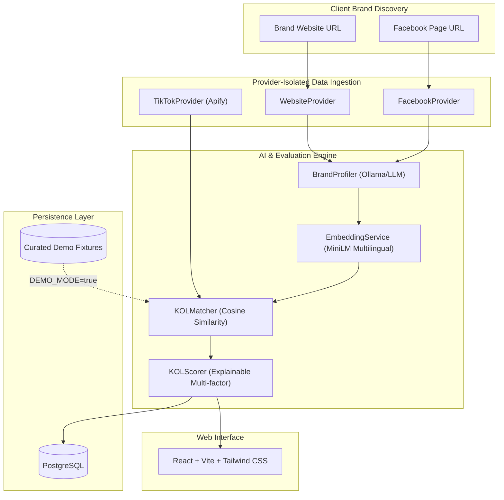

# ThaiKOL AI — System Architecture

## 1. Overview
ThaiKOL AI is an AI-powered influencer matching platform specifically tailored to the Thai market. It bridges the gap between brand marketing objectives and authentic TikTok creators by analyzing brand identity from client websites and Facebook pages, computing multilingual semantic embeddings, and generating explainable KOL recommendations.



## 2. Monorepo Structure
```
thaikol-ai/
├── backend/            # FastAPI, Pydantic, SQLAlchemy, Alembic
│   ├── api/            # API versioning & endpoint routers
│   ├── core/           # Configuration, logging, database connection
│   ├── models/         # SQLAlchemy ORM models
│   ├── schemas/        # Pydantic validation schemas
│   ├── services/       # Provider interfaces and concrete implementations
│   └── tests/          # Pytest automated test suites
├── frontend/           # React 18/19, TypeScript, Vite, Tailwind CSS
├── data/               # Fixtures and data integrity contracts
└── docs/               # Technical specs and architecture docs
```

## 3. Provider-Oriented Service Design
To ensure that external scrapers, AI models, and data actors can be upgraded or swapped without breaking core business logic, all services are isolated behind abstract interfaces:

1. **`WebsiteProvider`**: Extracts public semantic content (meta tags, mission statement, products, about page) from brand websites.
2. **`FacebookProvider`**: Retrieves public page descriptions, recent public posts, and brand categories.
3. **`TikTokProvider`**: Interfaces with TikTok crawlers (e.g. Apify actors) or mock fixture providers. Isolated behind an interface so the actor ID or API vendor can be replaced without backend changes.
4. **`BrandProfiler`**: Synthesizes extracted text into structured brand traits (product categories, audience demographics, tone of voice).
5. **`EmbeddingService`**: Computes dense vector representations using `sentence-transformers/paraphrase-multilingual-MiniLM-L12-v2`.
6. **`KOLMatcher`**: Computes semantic relevance between brand embeddings and KOL content vectors using cosine similarity.
7. **`KOLScorer`**: Combines semantic similarity, engagement health, and Thai audience proportion into an explainable score:
   $$\text{Final Score} = w_1 \cdot \text{SemanticRelevance} + w_2 \cdot \text{EngagementRate} + w_3 \cdot \text{ThaiAudienceRatio}$$

## 4. Resilience & Demo Mode (`DEMO_MODE=true`)
When external APIs are unreachable or when running the prototype offline:
- The system automatically serves curated fixtures from `data/fixtures/`.
- Every response clearly annotates provenance (`is_demo_fixture: true`).
