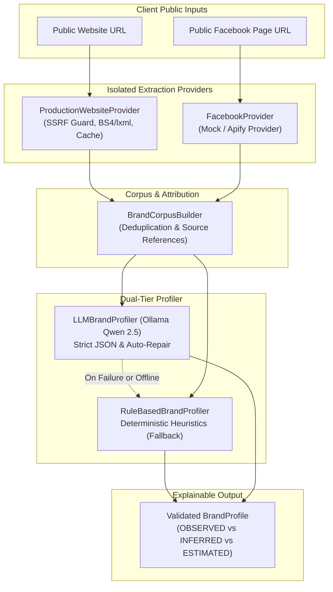

# ThaiKOL AI — Brand Discovery & Extraction Engine (Phase 1)

## 1. Problem
To match a commercial brand with relevant Thai TikTok KOLs, the system must first understand what the brand stands for: its core products, target consumer segments, brand tone, and geographical presence.
Manual brand analysis is slow, inconsistent, and difficult to scale. Relying solely on unstructured user input leads to vague prompt queries that yield poor creator matches. The Brand Discovery & Extraction Engine solves this by automatically converting public client digital assets (official website and Facebook page) into a structured, validated, and explainable **BrandProfile**.

---

## 2. Architecture & Pipeline Dataflow

---

## 3. Website Extraction (`ProductionWebsiteProvider`)
- **Engine**: HTTPX client + BeautifulSoup4 with `lxml` parser.
- **Noise Elimination**: Strips `<script>`, `<style>`, `<noscript>`, `<svg>`, `<canvas>`, `<header>`, `<footer>`, `<nav>`, and `<aside>` to prevent boilerplate navigation text from contaminating brand keywords.
- **Signals Extracted**:
  - `page_title`: HTML `<title>` tag.
  - `meta_description`: `<meta name="description">` or OpenGraph description.
  - `canonical_url`: Normalized canonical link.
  - `og_title` & `og_description`: OpenGraph social metadata.
  - `headings`: Key `<h1>`, `<h2>`, and `<h3>` tags capturing product headers and value propositions.
  - `visible_text`: Cleaned, whitespace-condensed text truncated at `WEBSITE_MAX_TEXT_LENGTH` (15,000 characters).
- **Security & SSRF Protections**:
  - Enforces `http` or `https` schemes only.
  - Explicitly rejects `localhost`, `0.0.0.0`, `127.0.0.1`, `::1`, and `.internal` / `.local` hostnames.
  - Resolves hostnames via DNS and rejects private (RFC 1918), loopback, link-local, multicast, or reserved IPv4/IPv6 ranges.
  - Follows redirects safely by validating intermediate and final URLs.
  - Enforces request timeouts (`WEBSITE_EXTRACT_TIMEOUT = 10s`) and max download size (`WEBSITE_MAX_RESPONSE_SIZE = 2MB`).
- **Caching**: Thread-safe in-memory cache keyed on normalized URL to eliminate redundant external requests.

---

## 4. Facebook Extraction (`FacebookProvider`)
- **Contract**: `FacebookPageContent` capturing `page_name`, `page_category`, `about`, `follower_count`, and a list of recent public `FacebookPost` items (`text`, `published_at`, `likes`, `comments`, `shares`).
- **Provider Implementations**:
  - `ApifyFacebookProvider`: Interfaces with Apify Facebook Pages Scraper using `APIFY_API_TOKEN` and `APIFY_FACEBOOK_ACTOR_ID`.
  - `MockFacebookProvider`: Deterministic mock provider serving authentic Thai business fixtures when `DEMO_MODE=true` or when external scrapers are offline.
- **Failure Resilience**: If Apify is down, times out, or has no token configured, a controlled provider error is recorded without crashing the API or blocking website extraction.

---

## 5. Brand Corpus (`BrandCorpus`)
Combines disparate channel extractions into a consolidated object:
- Merges candidate brand names from website titles, OpenGraph tags, and Facebook page headers.
- Aggregates website visible text, Facebook about bio, and recent Facebook post captions.
- Stores every text snippet in a `SourceReference` list (`{"source": "website"|"facebook", "source_url": "...", "post_id": "...", "text": "..."}`) to guarantee transparent provenance.
- Deduplicates identical repeated slogans or headers.

---

## 6. Rule-Based Profiling (`RuleBasedBrandProfiler`)
- **Deterministic Evaluation**: Implements deterministic heuristics based on verified Thai and English industry taxonomies (Natural Beauty, F&B, Wellness, Fashion, Tech).
- **Anti-Hallucination Guardrails**:
  - The profiler **never** fabricates customer demographics (e.g. age ranges like "20-35" or gender percentages) unless verbatim in the source corpus.
  - Audience signals are extracted only from observed problem statements (e.g. "แก้ผมร่วง" -> individuals with hair loss; "ผิวแพ้ง่าย" -> sensitive skin).
- **Location Extraction**: Detects geographical cues (e.g. Bangkok, Chiang Mai, Phetchabun, Phuket).

---

## 7. Ollama LLM Enrichment (`LLMBrandProfiler`)
- **Model**: Local Ollama LLM (`OLLAMA_MODEL=qwen2.5-coder:7b` or `qwen2.5:7b`).
- **Strict Prompt Engineering**: System prompts enforce:
  1. Relying strictly on supplied evidence.
  2. Forbidding demographic or fact fabrication.
  3. Formatting output exclusively as raw JSON conforming to the `BrandProfile` Pydantic schema.
- **Self-Healing JSON Retry**: If the LLM generates invalid JSON or fails schema validation, the system automatically submits a single JSON correction prompt.
- **Fail-Safe Fallback**: If Ollama is offline, unreachable, or fails after retry, the profiler automatically falls back to `RuleBasedBrandProfiler`.

---

## 8. Evidence Tracking & Nature Categories
To guarantee complete transparency and explainability, every major field in `BrandProfile` carries supporting `EvidenceItem` records classified into three strict categories:

| Nature | Definition | Example |
|---|---|---|
| **`OBSERVED`** | Direct, verbatim statement found in public source data. | Website meta description: *"เขาค้อทะเลภู แชมพูสมุนไพรธรรมชาติ 100%"* |
| **`INFERRED`** | Algorithmic or contextual deduction derived from patterns. | Tone: *"Authentic & Nature-inspired"* inferred from repeated herbal keywords and eco-friendly packaging themes. |
| **`ESTIMATED`** | Approximate metric or audience proxy measurement. | Follower tier or audience concentration score. |

---

## 9. DEMO_MODE (`DEMO_MODE=true`)
- When `DEMO_MODE=true` is set in `.env` or requested in demo runs, the system serves the canonical **Khaokho Talaypu (เขาค้อทะเลภู)** fixture from `data/fixtures/sample_brands.json`.
- Output is explicitly flagged with `"is_demo_fixture": true` and `"provenance": "curated_demo_fixture"` to ensure demo data is never misrepresented as live audits.

---

## 10. Error Handling & Partial Failures
The pipeline at `POST /api/v1/brands/analyze` gracefully degrades:
1. **Website OK + Facebook Failed**: Analyzes brand using website signals alone; reports Facebook error under `pipeline_status.facebook`.
2. **Facebook OK + Website Failed**: Analyzes brand using Facebook signals alone; reports website error under `pipeline_status.website`.
3. **Both Failed**: Returns a structured HTTP 422 error detailing both source failure reasons without an unhandled server exception (500).

---

## 11. Privacy & Ethical Standards
- **Public Surface Only**: Extracts only public metadata, public page bios, and public post captions.
- **Zero Personal Data**: Private user accounts, personal direct messages, customer profiles, or private group data are strictly excluded.
- **No Secret Leakage**: Apify tokens or backend secrets are never exposed in log lines or API response payloads.

---

## 12. Known Limitations & Future Roadmap
- **Client-Side Rendering (SPA)**: Heavy JavaScript SPAs without server-side rendering or OpenGraph meta tags may yield limited body text without a headless browser (Playwright integration planned for Phase 2).
- **Facebook Anti-Scraping**: Direct unauthenticated Facebook page access is rate-limited by Meta; Apify actor or cached fixtures are required for high reliability.
- **Next Phase (Phase 2)**: TikTok creator discovery and Thai KOL candidate ingestion.
