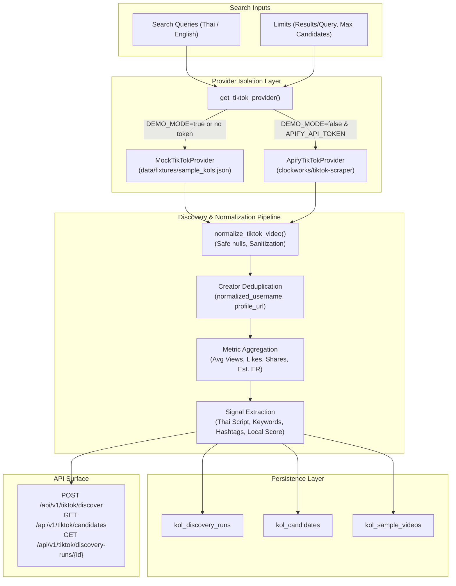

# ThaiKOL AI — TikTok Discovery & Thai KOL Candidate Ingestion (Phase 2)

## 1. Architecture Overview
Phase 2 establishes the creator candidate ingestion pipeline for ThaiKOL AI. The system searches public TikTok videos based on niche queries (derived from brand keywords or manual input), extracts creator metadata and sampled video statistics, normalizes records with safe null handling, deduplicates creators across queries, computes aggregated performance indicators and **Estimated Engagement Rates**, and extracts transparent Thailand locality signals.



---

## 2. Provider Isolation Pattern
External scrapers, APIs, and rate limits change constantly. To ensure our ranking algorithms and API contracts remain isolated from scraper idiosyncrasies, we define the abstract `TikTokProvider` interface in `backend/services/interfaces.py`:

```python
class TikTokProvider(ABC):
    @abstractmethod
    def discover_kols_by_keywords(
        self, keywords: List[str], limit: int = 20
    ) -> List[Dict[str, Any]]:
        """Discovers public TikTok creator profiles matching Thai niche keywords."""
        pass

    @abstractmethod
    def get_profile_details(self, handle: str) -> Dict[str, Any]:
        """Fetches public profile metadata, recent video captions, and baseline metrics."""
        pass
```

- **`MockTikTokProvider`**: Fully offline deterministic provider reading from `data/fixtures/sample_kols.json`. Guarantees reproducible, zero-cost, network-free demonstration and assessment testing.
- **`ApifyTikTokProvider`**: Live actor adapter using Apify's cloud infrastructure to scrape public TikTok data at scale without managing residential proxies locally.
- **`get_tiktok_provider()`**: Factory function enforcing safe selection:
  ```python
  def get_tiktok_provider() -> TikTokProvider:
      if not settings.DEMO_MODE and settings.APIFY_API_TOKEN:
          return ApifyTikTokProvider()
      return MockTikTokProvider()
  ```

---

## 3. Apify Integration Architecture
For live scraping, ThaiKOL AI interfaces with the standard Apify actor `clockworks/tiktok-scraper`:

- **Endpoint**: `https://api.apify.com/v2/acts/clockworks~tiktok-scraper/run-sync-get-dataset-items`
- **Input Parameters**:
  - `searchQueries`: Array of keyword strings (e.g. `["แชมพูสมุนไพร", "ลดผมร่วง"]`).
  - `resultsPerPage`: Integer capped at `TIKTOK_MAX_RESULTS_PER_QUERY` (default 20, max 50).
  - `searchSection`: `"/video"` (searches public videos containing keywords).
- **Authentication**: `Authorization: Bearer <APIFY_API_TOKEN>` sent strictly via HTTP headers. Token is never logged or exposed in client responses.
- **Timeout & Retries**: Controlled via `settings.TIKTOK_TIMEOUT` (default 60s) using `httpx.Client`. If Apify encounters rate limits or errors, exceptions are logged and an empty result is returned gracefully.
- **In-Memory Caching**: Responses are cached using `MemoryCacheService` (`cache_service`) for `settings.CACHE_TTL_SECONDS` (3600s) to minimize actor run fees and redundant executions.

---

## 4. Data Normalization Spec & Nature of Data
Raw data from scrapers is noisy, inconsistent, and often missing fields. Our pipeline transforms raw inputs into typed `TikTokVideo` records while strictly maintaining the **Nature of Data** integrity:

| Field Name | Type | Nature | Origin & Normalization Rule |
| :--- | :--- | :--- | :--- |
| `video_id` | `str` | **OBSERVED** | Raw video identifier. |
| `video_url` | `str` | **OBSERVED** | Canonical URL: `https://www.tiktok.com/@{user}/video/{id}`. |
| `creator_username` | `str` | **OBSERVED** | Stripped of `@` prefix and whitespace. |
| `creator_display_name` | `str` | **OBSERVED** | Display name as published on TikTok profile. |
| `creator_bio` | `Optional[str]` | **OBSERVED** | Public bio text; `None` if empty. |
| `creator_profile_url` | `str` | **OBSERVED** | Canonical profile URL `https://www.tiktok.com/@{username}`. |
| `follower_count` | `Optional[int]` | **OBSERVED** | Non-negative integer or `None`. |
| `views` | `Optional[int]` | **OBSERVED** | Video play count. Safe null if absent. |
| `likes` | `Optional[int]` | **OBSERVED** | Digg count. Safe null if absent. |
| `comments` | `Optional[int]` | **OBSERVED** | Comment count. Safe null if absent. |
| `shares` | `Optional[int]` | **OBSERVED** | Share count. Safe null if absent. |
| `saves` | `Optional[int]` | **OBSERVED** | Bookmark / collect count. Safe null if absent. |
| `hashtags` | `List[str]` | **OBSERVED** | Unique hashtags extracted from caption, stripped of `#`. |
| `caption` | `Optional[str]` | **OBSERVED** | Video description text. |
| `created_at` | `Optional[str]` | **OBSERVED** | ISO 8601 publication timestamp. |
| `average_views` | `Optional[float]` | **DERIVED** | Arithmetic mean of observed views across sampled videos. |
| `average_likes` | `Optional[float]` | **DERIVED** | Arithmetic mean of observed likes across sampled videos. |
| `average_comments`| `Optional[float]` | **DERIVED** | Arithmetic mean of observed comments across sampled videos. |
| `average_shares`  | `Optional[float]` | **DERIVED** | Arithmetic mean of observed shares across sampled videos. |
| `estimated_engagement_rate` | `Optional[float]` | **ESTIMATED** | Heuristic: `(avg_likes + avg_comments + avg_shares) / follower_count`. |
| `thai_language_ratio` | `float` | **DERIVED** | Ratio of Thai Unicode characters to total characters. |
| `local_signal_score` | `float` | **ESTIMATED** | Heuristic fit score from language, keywords, and hashtags. |

> [!IMPORTANT]
> **Anti-Fabrication Rule**: If a video or creator record lacks views, likes, or follower count, the field is left as `None` (`null` in JSON). Under no circumstances are missing metrics coerced to `0` (which would skew averages) or replaced with fabricated random numbers.

---

## 5. Creator Deduplication Strategy
A single discovery run often queries multiple terms (e.g. `["แชมพูสมุนไพร", "ลดผมร่วง", "organic hair"]`). Prominent Thai creators naturally appear across multiple search queries and multiple videos.

### Deduplication Rules:
1. **Canonical Identifier**:
   - `normalized_username = creator_username.strip().lstrip("@").lower()`
   - `profile_url = f"https://www.tiktok.com/@{normalized_username}"`
2. **Merging Multi-Query Evidence**:
   - **`matched_queries`**: Unique sorted union of all queries that surfaced this creator (e.g. `["แชมพูสมุนไพร", "ลดผมร่วง"]`).
   - **`sample_videos`**: Keyed by unique `video_id`. Videos appearing in multiple query result sets are stored once.
   - **`sample_captions`**: Deduplicated list of public captions across all sampled videos.
   - **`hashtags`**: Deduplicated list of hashtags across all sampled videos.
   - **`follower_count`**: Updated to the highest observed value across sampled records.
   - **`bio` & `display_name`**: Preserved from the most complete observed record.

---

## 6. Metric Aggregation Methodology
For each creator candidate, performance indicators are aggregated strictly across the observed sampled videos:

- **Sample Size**: `sample_video_count = len(sample_videos)`.
- **Totals**:
  $$\text{total\_views} = \sum_{v \in \text{valid\_views}} v$$
- **Averages**:
  Computed only over videos where the specific metric was non-null:
  $$\text{average\_views} = \frac{\text{total\_views}}{N_{\text{valid\_views}}}$$
  $$\text{average\_likes} = \frac{\text{total\_likes}}{N_{\text{valid\_likes}}}$$
  $$\text{average\_comments} = \frac{\text{total\_comments}}{N_{\text{valid\_comments}}}$$
  $$\text{average\_shares} = \frac{\text{total\_shares}}{N_{\text{valid\_shares}}}$$
  $$\text{average\_saves} = \frac{\text{total\_saves}}{N_{\text{valid\_saves}}}$$

If no videos contain a given metric, the average remains `None`.

---

## 7. Estimated Engagement Rate Formulation

### The Formula:
$$\text{Estimated Engagement Rate} = \frac{\text{average\_likes} + \text{average\_comments} + \text{average\_shares}}{\max(\text{follower\_count}, 1)}$$

### Engineering Rationale:
1. **Holistic Interaction Weight**: Likes indicate passive appreciation, comments indicate active discourse, and shares indicate viral resonance. Combining all three provides a balanced numerator of active audience engagement.
2. **Follower Normalization**: Dividing by `follower_count` normalizes engagement across nano-, micro-, and macro-influencers, allowing fair comparisons between creators of different audience sizes.
3. **Zero-Division Guard**: The denominator uses $\max(\text{follower\_count}, 1)$ to prevent runtime divide-by-zero crashes.
4. **Rounding**: Formatted to 4 decimal places (e.g. `0.0482` $\rightarrow$ 4.82%).

### Limitations & Required Disclaimers:
> [!NOTE]
> **Heuristic Disclaimer**: This metric is an **Estimated Engagement Rate** derived from sampled recent videos. It is **NOT** an official TikTok metric, does not represent a full-account lifetime audit, and does not capture private story interactions or profile visits.

---

## 8. Thailand & Local Fit Heuristics
To evaluate whether a creator actively speaks to the Thai domestic market, ThaiKOL AI extracts transparent, explainable heuristic signals from public content text (`bio` + `sample_captions` + `hashtags`):

### Heuristic 1: Thai Script Character Ratio (`thai_language_ratio`)
- Uses Unicode character range for the Thai script: `\u0E00` through `\u0E7F`.
- Calculated as:
  $$\text{ratio} = \frac{\text{count}(\text{Thai Unicode characters})}{\text{count}(\text{Word/Alphanumeric characters})}$$
- Output: Float between `0.0` (pure foreign language) and `1.0` (pure Thai language).

### Heuristic 2: Thailand Geographic & Cultural Keywords (`thailand_keyword_count`, `location_mentions`)
- Checks for known Thai provinces and geographic landmarks:
  - Bangkok (`กรุงเทพ`, `bkk`, `สยาม`, `อารีย์`, `เยาวราช`, `สุขุมวิท`)
  - Chiang Mai (`เชียงใหม่`, `chiang mai`, `ดอยช้าง`)
  - Phetchabun (`เขาค้อ`, `เพชรบูรณ์`, `khaokho`)
  - Phuket (`ภูเก็ต`, `phuket`), Pattaya (`พัทยา`), Hua Hin (`หัวหิน`)
- Returns the total count of keyword occurrences and a list of distinct location mentions.

### Heuristic 3: Thailand Hashtag Frequency (`thailand_hashtag_count`)
- Scans all aggregated hashtags.
- Increments if the hashtag contains Thai script or references Thailand terms (`#รีวิวบิวตี้`, `#ลดผมร่วง`, `#สมุนไพร`, `#bangkok`).

### Heuristic 4: Composite Local Signal Score (`local_signal_score`)
Calculated using a transparent weighted additive model:
- **Thai Language Ratio**: contributes up to `0.50` (`thai_language_ratio * 0.50`).
- **Thailand Keywords**: contributes up to `0.25` ($\min(\text{keywords}, 5) \times 0.05$).
- **Thailand Hashtags**: contributes up to `0.15` ($\min(\text{hashtags}, 5) \times 0.03$).
- **Explicit Location Mentions**: adds `0.10` if any city/province is detected.
- **Bounds**: Clamped strictly between `[0.0, 1.0]`.

---

## 9. Demographics vs Local Signals Boundary
A critical tenet of the ThaiKOL AI architecture is absolute transparency regarding data limitations:

```
┌─────────────────────────────────────────────────────────────┐
│                 CONTENT-BASED LOCAL SIGNALS                 │
│  - Thai Unicode character ratio in captions                 │
│  - Mentions of Thai provinces (e.g. Bangkok, Chiang Mai)    │
│  - Thai script hashtags (#รีวิว, #ใช้ดีบอกต่อ)              │
│  - Explicit language and cultural cues                      │
│                                                             │
│  ==> COMPUTED BY: Rule-based Heuristics                     │
│  ==> NATURE: DERIVED & ESTIMATED CONTENT SIGNALS            │
└──────────────────────────────┬──────────────────────────────┘
                               │
                DO NOT CONFUSE WITH OR CLAIM:
                               │
                               ▼
┌─────────────────────────────────────────────────────────────┐
│                 AUDIENCE DEMOGRAPHICS (FALSE)               │
│  - ❌ "Audience age distribution: 18-24 (45%)"              │
│  - ❌ "Audience gender ratio: Female (78%)"                 │
│  - ❌ "Audience verified physical location"                 │
│  - ❌ "Audience household income"                           │
│                                                             │
│  ==> REALITY: Private first-party TikTok Analytics data     │
│  ==> PROHIBITION: Never fabricate or pretend to know this!  │
└─────────────────────────────────────────────────────────────┘
```

> [!CAUTION]
> **Mandatory System Disclaimer**:
> `"The local_signal_score represents Thailand/local content signals derived from public captions, bios, and hashtags. It does NOT represent verified audience location, age, or demographics."`

---

## 10. Offline / Demo Mode Architecture
To satisfy the internship assessment requirement of **100% reliable execution without external network dependency**, ThaiKOL AI includes `MockTikTokProvider`:

- **Data Source**: `data/fixtures/sample_kols.json` containing 11 authentic, realistic Thai creator profiles:
  1. `@mookda_skincare`: Herbal hair care, sensitive skin, butterfly pea shampoo
  2. `@cleanlife_pat`: Eco-friendly & sustainable lifestyle in Bangkok
  3. `@dr_somchai_herb`: Thai herbal traditional medicine & holistic wellness
  4. `@fah_naturalglow`: Clean beauty, gentle hair care & Thai organic remedies
  5. `@golf_wellness`: Holistic wellness & scalp care for men
  6. `@baankhaokho_herb`: Phetchabun herbal agriculture & botanical extracts
  7. `@aom_reviewth`: Bangkok lifestyle, beauty & daily hair care routine
  8. `@thaiherb_pharmacist`: Evidence-based herbal analysis & hair follicle science
  9. `@pleng_ecoliving`: Zero-waste & natural cosmetic DIY
  10. `@dew_barber_wellness`: Scalp care & hair restoration specialist
  11. `@nong_phuketherb`: Southern Thai botanical oils & holistic wellness
- **Behavior**: When `settings.DEMO_MODE=true` (or when `APIFY_API_TOKEN` is not provided), all discovery operations execute completely in-memory and offline.
- **Safety**: Tagged with `is_demo_fixture: true`, `data_source: "demo_fixture"`, `provenance: "curated_demo_fixture"`.

---

## 11. Database Schema & Alembic Migration
Candidates, sample videos, and discovery runs are persisted in relational tables using SQLAlchemy models:

### Table `kol_candidates`
| Column | Type | Constraints | Description |
| :--- | :--- | :--- | :--- |
| `id` | `VARCHAR(36)` | PK | UUID primary key |
| `username` | `VARCHAR(100)` | Not Null | Creator handle |
| `normalized_username` | `VARCHAR(100)` | Unique, Index | Lowercased unique handle |
| `display_name` | `VARCHAR(255)` | Not Null | Creator display name |
| `profile_url` | `VARCHAR(512)` | Index | Public TikTok profile URL |
| `bio` | `TEXT` | Nullable | Public bio text |
| `follower_count` | `INTEGER` | Nullable | Follower count |
| `sample_video_count` | `INTEGER` | Default 0 | Sampled videos aggregated |
| `average_views` | `FLOAT` | Nullable | Average view count |
| `average_likes` | `FLOAT` | Nullable | Average like count |
| `average_comments` | `FLOAT` | Nullable | Average comment count |
| `average_shares` | `FLOAT` | Nullable | Average share count |
| `average_saves` | `FLOAT` | Nullable | Average save count |
| `estimated_engagement_rate` | `FLOAT` | Nullable | Derived engagement rate |
| `matched_queries` | `JSON` | Default `[]` | Surfacing search queries |
| `hashtags` | `JSON` | Default `[]` | Unique hashtags |
| `sample_captions` | `JSON` | Default `[]` | Sample video captions |
| `thai_language_ratio` | `FLOAT` | Default 0.0 | Thai script character ratio |
| `thailand_keyword_count` | `INTEGER` | Default 0 | Thailand keyword matches |
| `thailand_hashtag_count` | `INTEGER` | Default 0 | Thailand hashtag matches |
| `location_mentions` | `JSON` | Default `[]` | Detected location names |
| `local_signal_score` | `FLOAT` | Default 0.0 | Locality content score |
| `data_source` | `VARCHAR(50)` | Index | `live` or `demo_fixture` |
| `is_demo_fixture` | `BOOLEAN` | Default False | Demo fixture flag |
| `collected_at` | `DATETIME` | Index | Ingestion timestamp |
| `updated_at` | `DATETIME` | Nullable | Last update timestamp |

### Table `kol_sample_videos`
- `id` (PK, UUID)
- `kol_candidate_id` (FK to `kol_candidates.id`, `ON DELETE CASCADE`)
- `video_id` (Indexed), `video_url`, `caption`, `hashtags` (JSON)
- `views`, `likes`, `comments`, `shares`, `saves` (Nullable Integers)
- `created_at`, `collected_at`

### Table `kol_discovery_runs`
- `id` (PK, UUID)
- `queries` (JSON), `provider` (`VARCHAR(50)`), `status` (`running`, `success`, `partial`)
- `candidate_count`, `started_at`, `completed_at`, `error`

---

## 12. API Reference

### `POST /api/v1/tiktok/discover`
Executes candidate discovery and returns deduplicated candidates.
- **Request Body**:
  ```json
  {
    "queries": ["แชมพูสมุนไพร", "ลดผมร่วง"],
    "max_results_per_query": 20,
    "max_candidates": 30
  }
  ```
- **Response (200 OK)**:
  ```json
  {
    "discovery_run_id": "9b12e3e5-87d2-430b-b5d1-11910d5df02a",
    "status": "success",
    "candidate_count": 2,
    "candidates": [
      {
        "username": "mookda_skincare",
        "normalized_username": "mookda_skincare",
        "display_name": "Mookda รีวิวผิวสวย",
        "profile_url": "https://www.tiktok.com/@mookda_skincare",
        "follower_count": 145000,
        "sample_video_count": 2,
        "average_views": 38000.0,
        "average_likes": 1975.0,
        "average_comments": 121.5,
        "average_shares": 78.5,
        "estimated_engagement_rate": 0.015,
        "matched_queries": ["ลดผมร่วง", "แชมพูสมุนไพร"],
        "thai_language_ratio": 0.88,
        "thailand_keyword_count": 2,
        "location_mentions": ["Thailand (General)"],
        "local_signal_score": 0.74,
        "is_demo_fixture": true,
        "data_source": "demo_fixture"
      }
    ]
  }
  ```

### `GET /api/v1/tiktok/candidates`
Lists stored creator candidates with pagination and keyword filtering.
- **Query Parameters**: `query` (optional string), `limit` (int, default 50), `offset` (int, default 0).

### `GET /api/v1/tiktok/discovery-runs/{run_id}`
Returns metadata and status of an audit run.

---

## 13. Security, Privacy & Compliance
1. **Public Data Only**: ThaiKOL AI interacts exclusively with public videos and public creator bios. It requires no TikTok user login, OAuth session, or private account credentials.
2. **Zero Hardcoded Secrets**: `APIFY_API_TOKEN` is loaded strictly from environment variables.
3. **SSRF Guard**: Public URLs are strictly validated to prevent local network traversal.
4. **Resilient Offline Demoware**: If network is severed or Apify is unreachable, `DEMO_MODE=true` ensures seamless evaluation without crashes.

---

## 14. Test Suite Strategy
All Phase 2 functionality is validated with automated pytest test suites:
- `tests/test_tiktok_provider.py`: Validates `MockTikTokProvider` discovery, profile lookups, and `ApifyTikTokProvider` token guard.
- `tests/test_tiktok_normalization.py`: Validates `TikTokVideo` field sanitization, hashtag extraction, and **safe null preservation** (anti-fabrication).
- `tests/test_creator_deduplication.py`: Validates deduplication of creators across distinct search queries and arithmetic metric aggregation.
- `tests/test_tiktok_signals.py`: Validates Thai Unicode character ratio, keyword extraction, and heuristic score bounds.
- `tests/test_tiktok_db.py`: Validates SQLite in-memory table creation, model relationships, and upsert handling without duplicate key collisions.
- `tests/test_tiktok_api.py`: Validates discovery API endpoints, input validation, query cleaning, and error responses.

---

## 15. Future Phase Integration
Phase 2 ingests and organizes public creator candidates. The candidates produced here provide the input for subsequent phases:
- **Phase 3 (Vector Embedding & Semantic Matching)**: Candidate `bio`, `sample_captions`, and `hashtags` will be encoded into dense vector embeddings using `sentence-transformers/paraphrase-multilingual-MiniLM-L12-v2` and compared against the Phase 1 `BrandProfile` vector via cosine similarity.
- **Phase 4 (Explainable Scoring & Dashboard)**: The semantic similarity score, estimated engagement rate, and local signal score will be combined into a multi-factor ranking formula with evidence-backed recommendation rationales.
